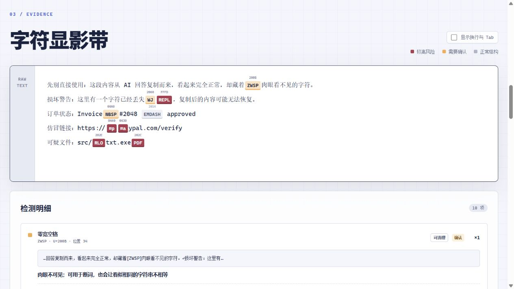
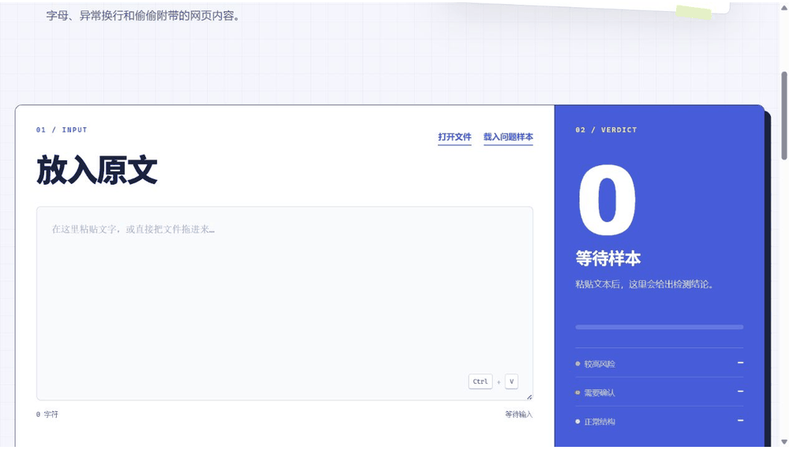

# Paste X-Ray

**让不可见字符留下指纹。**

有些文字看起来完全正常，里面却可能藏着看不见的字符、冒牌字母、反向显示指令或网页标签。它们会让链接失效、代码报错，也可能把假网址伪装成真网址。

Paste X-Ray 会把这些东西直接标出来。你不需要了解字符编码，也不需要安装软件。

> [立即在线使用 Paste X-Ray](https://nisconder.github.io/paste-xray/)



## 看它怎么用



## 三步完成检查

1. 粘贴文字，或者把文件直接拖进输入框。
2. 查看被标出来的位置和处理建议。
3. 清理后复制，或者导出一份网页报告留档分享。

所有检查都在当前浏览器里完成，文字和文件不会上传。

## 安装浏览器插件

插件版支持 Chrome 和 Edge。点击工具栏图标可以打开完整检测页；在网页中选中文字后点右键，也可以直接送进 Paste X-Ray 检查。

目前先提供本地安装版：

1. 点击 GitHub 页面右上角的 **Code → Download ZIP**，下载并解压项目。
2. Chrome 打开 `chrome://extensions`；Edge 打开 `edge://extensions`。
3. 打开页面上的“开发者模式”。
4. 点击“加载已解压的扩展程序”，选择包含 `manifest.json` 的项目文件夹。
5. 把 Paste X-Ray 固定到浏览器工具栏，即可随时使用。

插件只申请“添加右键菜单”和“临时传递选中文字”两项权限，不读取全部网页，也不主动读取剪贴板。选中的文字被检测页取走后，会立即从插件临时内存中删除。

## 它能帮你发现什么

- 肉眼看不见、却会让搜索或代码出错的隐藏字符
- 长得像英文字母、实际却是另一种字符的“冒牌字母”
- 会把文件名或代码显示顺序偷偷反过来的控制符
- 网页、Word 或 PDF 带来的特殊空格和异常换行
- 从网页粘贴时一起带进来的隐藏标签、样式和链接
- 已经损坏、无法从当前文字中恢复的 `�`

每一项都会告诉你它出现在哪里、可能从哪里来，以及应该保留、清理还是重新确认。

## 主要功能

- 支持直接粘贴、选择文件和拖入文件，单个文件最大 5 MB
- 支持从浏览器工具栏打开，以及右键检查网页中选中的文字
- 检查常见文字、Markdown、代码、JSON、CSV、日志等文件
- 识别网址、账号、文件名和代码中的冒牌字母，同时避免把正常外语整段误报
- 把零宽字符、特殊空格、反向显示指令、异常换行和不可打印字符全部显形
- 分成“较高风险 / 需要确认 / 正常结构”，并展示原文上下文和下一步建议
- 同时查看剪贴板里的纯文字和网页源码
- 所有清理选项默认关闭，确认后再清理和复制
- 导出可独立打开的网页扫描报告，方便留档或发给别人检查

## 隐私与安全

- 不需要账号
- 不依赖后端服务
- 不上传或保存检查内容
- 不使用遥测或分析脚本
- 文件读取、文字检查和报告生成都在浏览器本地完成
- 扫描报告会包含被检查的内容，分享前请确认里面没有密码、密钥或个人信息

## 本地运行

这是一个无依赖的纯前端项目。在 Windows 中直接双击 **`打开 Paste X-Ray.cmd`**，也可以直接打开 `index.html`。

如果浏览器限制了本地文件功能，可以在项目目录启动一个临时本地服务器：

```powershell
python -m http.server
```

命令会显示访问地址；在浏览器中打开即可。

## 文件打不开怎么办

大多数由记事本、代码编辑器和办公软件保存的文字文件都能直接读取。如果页面提示无法识别，用记事本打开文件，重新保存后再拖入即可。单个文件不要超过 5 MB。

## 运行测试

```powershell
node --test tests/app.test.cjs
```

自动测试覆盖隐藏字符、冒牌字母、文件读取、误报保护、清理结果和扫描报告。

## 反馈

如果你发现漏检、误报或浏览器兼容问题，请[提交 Issue](https://github.com/nisconder/paste-xray/issues)。

## License

[MIT](LICENSE)
